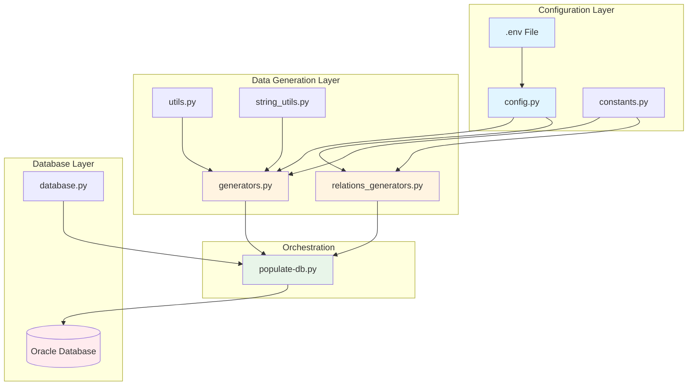
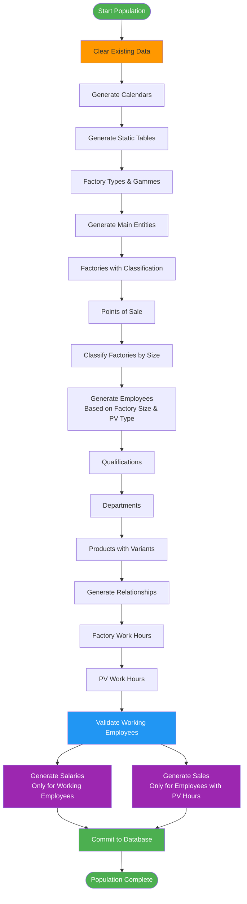
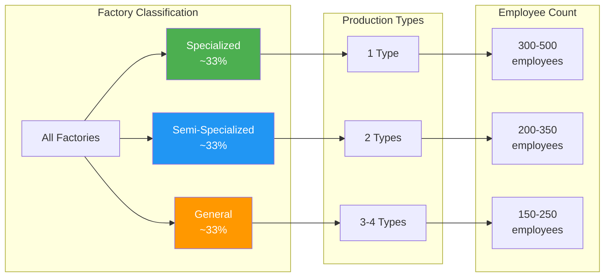
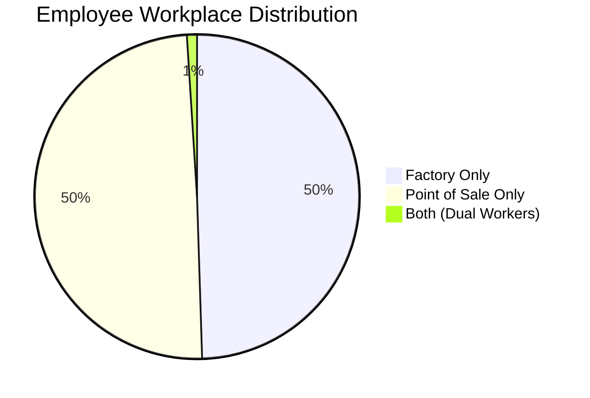
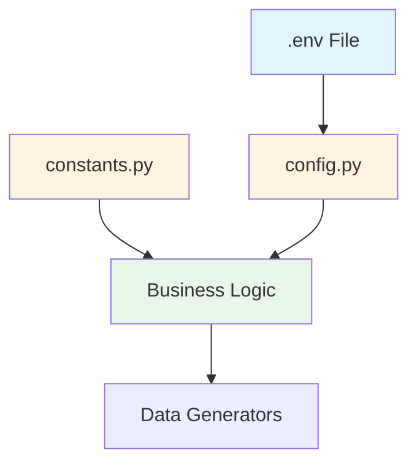
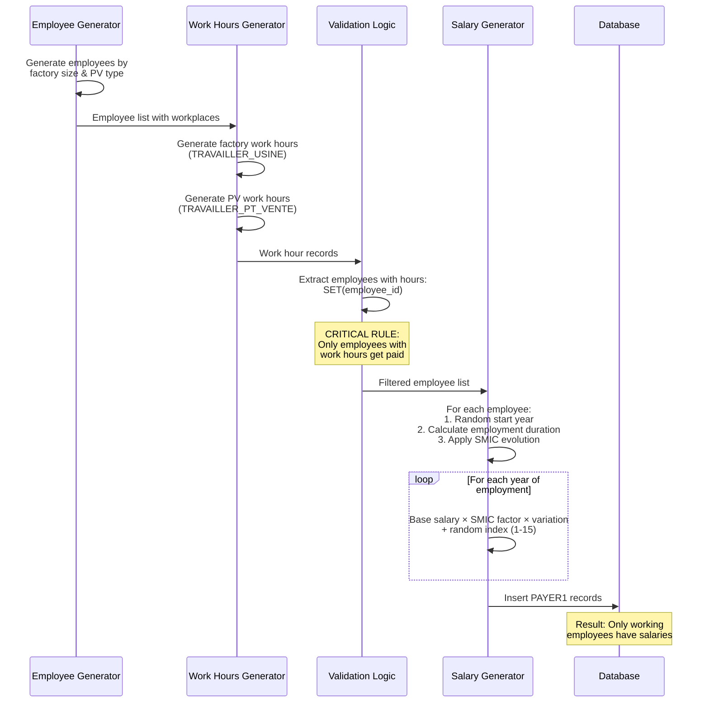
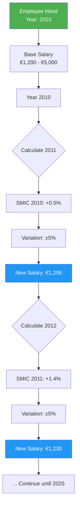
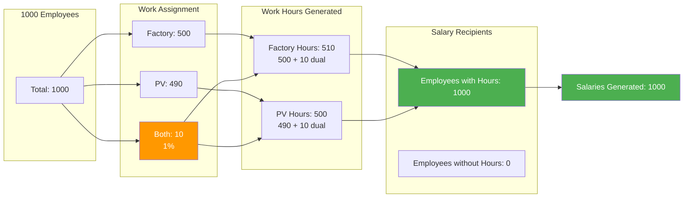
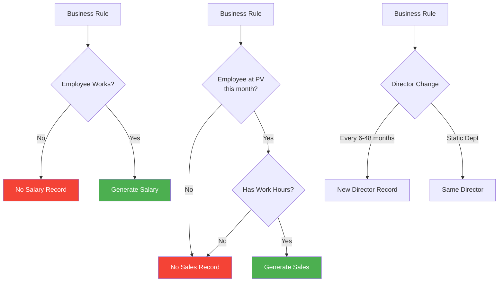
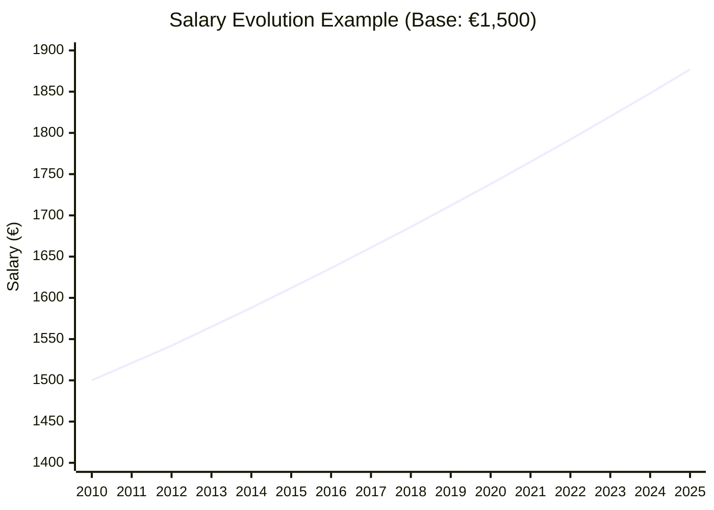

# Data Population Strategy and Implementation

## Table of Contents

1. [Overview](#overview)
2. [Architecture and Design Principles](#architecture-and-design-principles)
3. [Data Generation Framework](#data-generation-framework)
4. [Realistic Data Generation](#realistic-data-generation)
5. [Configuration System](#configuration-system)
6. [Complex Example: Employee Work Hours and Salary](#complex-example-employee-work-hours-and-salary)
7. [Data Integrity and Constraints](#data-integrity-and-constraints)
8. [Performance Optimization](#performance-optimization)

---

## Overview

The Brico Plus database population system is a sophisticated Python-based framework designed to generate realistic, coherent, and statistically valid data for a complex business management system. The implementation goes beyond simple random data generation by incorporating real-world business rules, statistical distributions, and temporal consistency.

### Key Characteristics

-   **Realistic Data**: All generated data follows real-world patterns and distributions
-   **Configurable**: Extensive configuration system allows customization without code changes
-   **Scalable**: Capable of generating thousands of records while maintaining referential integrity
-   **Statistically Valid**: Uses normal distributions, SMIC-based salary calculations, and temporal evolution
-   **Business Rule Compliant**: Enforces business logic such as "no work = no pay"

---

## Architecture and Design Principles

The system follows a modular architecture with clear separation of concerns:



### Design Principles

1. **Modularity**: Each component has a single, well-defined responsibility
2. **Configurability**: Business rules and parameters are externalized to configuration files
3. **Data Realism**: Real French addresses, surnames, SMIC salary evolution, and business distributions
4. **Referential Integrity**: All foreign key relationships are maintained through careful generation order
5. **Temporal Consistency**: Time-based data respects chronological order and business cycles

---

## Data Generation Framework

### Generation Flow

The data population follows a carefully orchestrated sequence to maintain referential integrity:



### Key Components

#### 1. Generators Module (`generators.py`)

Responsible for generating base entities:

-   **Factories** with realistic addresses
-   **Points of Sale** (Brico-Express vs GSB)
-   **Employees** with professional addresses near their workplace
-   **Products** with multiple brand variants
-   **Qualifications** following French diploma system

#### 2. Relations Generators Module (`relations_generators.py`)

Handles complex relationships and time-based data:

-   **Work hours** with temporal consistency
-   **Salaries** with SMIC-based evolution
-   **Sales** linked to work hours
-   **Department assignments** with director changes
-   **Manufacturing records** based on factory specialization

#### 3. Database Module (`database.py`)

Manages database operations:

-   **Connection handling** with Oracle DB
-   **Constraint management** (disable during deletion, re-enable after)
-   **Transaction control** with commit/rollback

---

## Realistic Data Generation

### 1. Address Generation

Real French addresses are used from a comprehensive dataset:

```python
# Real addresses from French postal database
ADRESSES_PAR_ZONE = {
    "Alsace": [
        "12 Rue des Tanneurs, 67000 Strasbourg",
        "45 Avenue de la Marseillaise, 68100 Mulhouse",
        # ... 500+ real addresses
    ]
}
```

**Professional Address Proximity**: Employee professional addresses are generated near their workplace using the same postal code or city.

### 2. Factory Classification System

Factories are classified into three categories based on specialization, directly affecting employee count:



**Configuration**:

```env
FACTORY_SPECIALIZED_MIN=300
FACTORY_SPECIALIZED_MAX=500
FACTORY_SEMI_SPECIALIZED_MIN=200
FACTORY_SEMI_SPECIALIZED_MAX=350
FACTORY_GENERAL_MIN=150
FACTORY_GENERAL_MAX=250
```

### 3. Point of Sale Types

Two distinct types with different characteristics:

| Type                     | Probability | Employees | Product Range   | Sales Volume       |
| ------------------------ | ----------- | --------- | --------------- | ------------------ |
| **Brico-Express**        | 30%         | 8-15      | 20-50 products  | Low (1-25 units)   |
| **GSB** (Grande Surface) | 70%         | 75-150    | 80-200 products | High (5-100 units) |

### 4. Product Variant Generation

Each product type generates multiple brand variants:

```python
# Example: "Electric Drill" generates 2-4 variants
# - Electric Drill (Bosch)
# - Electric Drill (DeWalt)
# - Electric Drill (Makita)
```

**Configuration**: `PRODUITS_VARIANTS_MIN=2`, `PRODUITS_VARIANTS_MAX=4`

### 5. Dual Workplace Feature

A configurable percentage of employees work at both a factory AND a point of sale:



**Business Rules for Dual Workers**:

-   Work 60-80 hours/month at each location (instead of 120-160 full-time)
-   Must have work hours at both locations
-   Receive salary based on total hours
-   Can only sell at their assigned point of sale

**Configuration**: `DUAL_WORKPLACE_PERCENTAGE=0.01` (1%)

---

## Configuration System

All critical parameters are externalized to allow easy customization without modifying code:

### Configuration Hierarchy



### Key Configuration Categories

#### 1. Database Connection

```env
ORACLE_HOST=your.server.com
ORACLE_PORT=1521
ORACLE_SERVICE=service_name
ORACLE_USER=username
ORACLE_PASS=password
```

#### 2. Generation Counts

```env
NOMBRE_USINES=15              # Number of factories
NOMBRE_POINTS_VENTE=50        # Number of points of sale
```

#### 3. Employee Distribution

```env
# Factory employees (by specialization)
FACTORY_SPECIALIZED_MIN=300
FACTORY_SPECIALIZED_MAX=500
# ... (semi-specialized, general)

# Point of sale employees (by type)
PV_EXPRESS_MIN=8
PV_EXPRESS_MAX=15
PV_GSB_MIN=75
PV_GSB_MAX=150
```

#### 4. Product Configuration

```env
PRODUITS_VARIANTS_MIN=2       # Min brand variants per product
PRODUITS_VARIANTS_MAX=4       # Max brand variants per product
```

#### 5. Calendar Settings

```env
CALENDRIER_DATE_DEBUT=2000-01-01
CALENDRIER_DATE_FIN=2025-10-31
```

#### 6. Special Features

```env
DUAL_WORKPLACE_PERCENTAGE=0.01    # 1% work at both locations
```

---

## Complex Example: Employee Work Hours and Salary

This example demonstrates the sophisticated logic behind employee salary generation, incorporating temporal evolution, SMIC-based calculations, and business rule enforcement.

### Business Rules

1. **No work = No pay**: Employees must have work hours to receive salary
2. **Temporal consistency**: Salary records align with employment periods
3. **SMIC compliance**: Salaries follow French minimum wage evolution
4. **Continuous employment**: 95% work until present, 5% leave early

### Data Flow



### Work Hours Generation Algorithm

```python
def gen_travailler_usine_with_ids(employes_ids, departements_ids,
                                   employee_workplace, cal3):
    """
    Generate factory work hours with realistic patterns
    """
    # For each factory employee
    for emp_id, factory_id in factory_employees:
        # Random employment start (between 0 and calendar_length - 12 months)
        start_idx = random.randint(0, max(0, len(calendar) - 12))

        # 95% work until present, 5% leave early
        if random.random() < 0.05:
            duration = random.randint(6, 24)  # 6-24 months
            end_idx = start_idx + duration
        else:
            end_idx = len(calendar)  # Until present

        # Generate continuous work hours
        for month_idx in range(start_idx, end_idx):
            month, year = calendar[month_idx]

            # Determine hours based on worker type
            if is_dual_worker:
                hours = random.uniform(60, 80)  # Part-time (split location)
            elif random.random() < 0.8:
                hours = random.uniform(120, 160)  # Full-time
            else:
                hours = random.uniform(35, 119)  # Part-time
```

### Salary Calculation with SMIC Evolution

The salary system uses real French SMIC (minimum wage) evolution data:



**Implementation**:

```python
def gen_payer1_with_ids(employes_ids, cal_yyyy):
    """
    Generate salary evolution based on SMIC trends
    """
    SMIC_DATA = [
        {"date": "2010-01-01", "percentage": 0.005},  # +0.5%
        {"date": "2011-01-01", "percentage": 0.014},  # +1.4%
        # ... historical SMIC data
    ]

    for employee_id in employes_ids:
        start_year = random.choice(available_years)
        base_salary = random.uniform(1200, 5000)

        for year in range(start_year, current_year + 1):
            # Get SMIC increase for this year
            smic_increase = get_smic_for_year(year)

            # Apply variation (±5%)
            variation = random.uniform(-0.05, 0.05)
            yearly_increase = smic_increase * (1 + variation)

            # Calculate cumulative factor
            increase_factor *= (1 + yearly_increase)

            # Final salary for this year
            salary = base_salary * increase_factor
            index = random.randint(1, 15)  # Salary index

            # Insert record
            records.append((employee_id, year, salary, index))
```

### Validation and Business Rule Enforcement

```python
# Step 1: Generate work hours
factory_hours = gen_travailler_usine_with_ids(...)
pv_hours = gen_travailler_pv_with_ids(...)

# Step 2: Extract employees who actually worked
employees_with_hours = set()
for record in factory_hours:
    employees_with_hours.add(record[0])  # CODEE
for record in pv_hours:
    employees_with_hours.add(record[0])  # CODEE

# Step 3: ONLY generate salaries for working employees
working_employees = list(employees_with_hours)
salaries = gen_payer1_with_ids(working_employees, calendar)

# Result: 100% of salaried employees have work hours
```

### Statistical Distribution Example



---

## Data Integrity and Constraints

### Referential Integrity Strategy

The system ensures all foreign key relationships are valid through:

1. **Ordered Generation**: Parent entities before children
2. **ID Mapping**: Database-generated IDs are captured and used for relationships
3. **Validation**: Business rules prevent invalid relationships

### Critical Business Rules



### Implementation of "No Work = No Pay"

```python
# Collect employees with work hours
employees_with_hours = set()
for work_record in factory_hours + pv_hours:
    employees_with_hours.add(work_record[0])

# Generate salaries ONLY for working employees
salary_records = gen_payer1_with_ids(
    list(employees_with_hours),  # Filtered list
    calendar_years
)

# Statistics
print(f"Total employees: {len(all_employees)}")
print(f"Employees with hours: {len(employees_with_hours)}")
print(f"Employees without hours: {len(all_employees) - len(employees_with_hours)}")
print(f"Salary records: {len(salary_records)}")
# Output: Salary records == Employees with hours
```

### Sales Linked to Work Hours

```python
def gen_vendre_with_ids(..., trav_pv):
    # Build index of (employee, pv, month, year) with work hours
    employee_pv_month_hours = set()
    for codee, codepv, mois, annee, heures in trav_pv:
        employee_pv_month_hours.add((codee, codepv, mois, annee))

    # For each potential sale
    for month, year in sales_dates:
        # Filter employees who worked THIS MONTH at THIS PV
        eligible_employees = [
            emp for emp in pv_employees
            if (emp, pv_id, month, year) in employee_pv_month_hours
        ]

        # Only eligible employees can generate sales
        for employee in eligible_employees:
            generate_sale(employee, pv_id, month, year)
```

---

## Performance Optimization

### Constraint Management

To avoid lock issues and improve performance during data deletion:

```python
def clear_all_data(cursor):
    # 1. Disable all foreign key constraints
    constraints = get_all_foreign_keys()
    for constraint in constraints:
        cursor.execute(f"ALTER TABLE {table} DISABLE CONSTRAINT {constraint}")

    # 2. Delete all data (no FK checks = faster)
    for table in all_tables:
        cursor.execute(f"DELETE FROM {table}")

    # 3. Re-enable constraints
    for constraint in constraints:
        cursor.execute(f"ALTER TABLE {table} ENABLE CONSTRAINT {constraint}")
```

### Batch Insertion

```python
# Use executemany for bulk inserts (much faster than individual inserts)
cursor.executemany(
    "INSERT INTO EMPLOYES(...) VALUES (:1,:2,:3,...)",
    employee_records  # List of tuples
)
```

### Progress Reporting

```python
for i, record in enumerate(large_dataset):
    process_record(record)
    if i % 1000 == 0:
        print(f"Progress: {i}/{len(large_dataset)} records")
```

---

## Statistical Validation

### Normal Distribution Usage

Several aspects use normal distributions for realism:

1. **Employee Count per Factory**:

    - Specialized: μ=400, σ=50 (300-500 range)
    - Semi-specialized: μ=275, σ=37.5 (200-350 range)
    - General: μ=200, σ=25 (150-250 range)

2. **Work Hours**:

    - Full-time: μ=140, σ=10 (120-160 range)
    - Part-time: μ=77, σ=21 (35-119 range)

3. **Product Variants**:
    - μ=3, σ=0.5 (2-4 range)

### Temporal Patterns



**Formula**:
$$Salary_{year} = Salary_{base} \times \prod_{y=start}^{current} (1 + SMIC_y \times (1 + Variation_y))$$

Where:

-   $SMIC_y$ = Official SMIC increase for year $y$
-   $Variation_y$ = Random variation $\in [-5\%, +5\%]$

---

## Conclusion

The Brico Plus data population system represents a comprehensive approach to generating realistic, coherent, and statistically valid test data. Key achievements include:

### Technical Excellence

-   **Modular architecture** with clear separation of concerns
-   **Configurable parameters** allowing adaptation without code changes
-   **Performance optimization** through batch operations and constraint management

### Data Quality

-   **Realistic data** using real French addresses, SMIC evolution, and business patterns
-   **Statistical validity** through normal distributions and temporal consistency
-   **Referential integrity** maintained through careful generation order

### Business Logic Compliance

-   **Strict business rules**: No work = No pay, Sales require work hours
-   **Temporal consistency**: Employment periods, salary evolution, continuous work hours
-   **Dual workplace support**: Configurable percentage with proper hour distribution

### Scalability

-   Capable of generating **thousands of employees** (300-500 per specialized factory)
-   **Hundreds of thousands** of work hour records
-   **Complex relationships** maintained across all entities

This system provides a solid foundation for testing, development, and demonstration of the Brico Plus business management system.

---

## Appendix: Key Metrics

| Metric                | Typical Values       |
| --------------------- | -------------------- |
| **Factories**         | 15                   |
| **Points of Sale**    | 50                   |
| **Employees**         | 3,000-7,000          |
| **Products**          | 500-1,000            |
| **Work Hour Records** | 100,000+             |
| **Salary Records**    | 50,000-150,000       |
| **Sales Records**     | 10,000-50,000        |
| **Calendar Span**     | 2000-2025 (26 years) |
| **Generation Time**   | 30-60 seconds        |

### Data Integrity Verification

```sql
-- Verify no employee has salary without work hours
SELECT COUNT(*) FROM PAYER1 p
WHERE NOT EXISTS (
    SELECT 1 FROM TRAVAILLER_USINE tu WHERE tu.CODEE = p.CODEE
    UNION
    SELECT 1 FROM TRAVAILLER_PT_VENTE tpv WHERE tpv.CODEE = p.CODEE
);
-- Expected: 0

-- Verify sales only occur when employee has work hours that month
SELECT COUNT(*) FROM VENDRE v
WHERE NOT EXISTS (
    SELECT 1 FROM TRAVAILLER_PT_VENTE tpv
    WHERE tpv.CODEE = v.CODEE
    AND tpv.CODEPV = v.CODEPV
    AND tpv.MOIS = v.MOIS
    AND tpv.ANNEE = v.ANNEE
);
-- Expected: 0
```

---

_This document was generated as part of the Brico Plus database project Phase 2 report._
