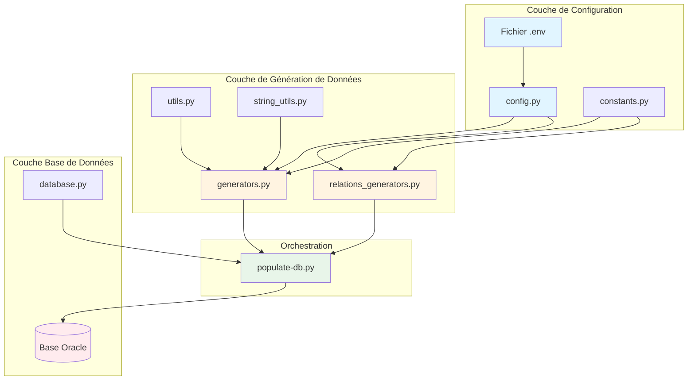
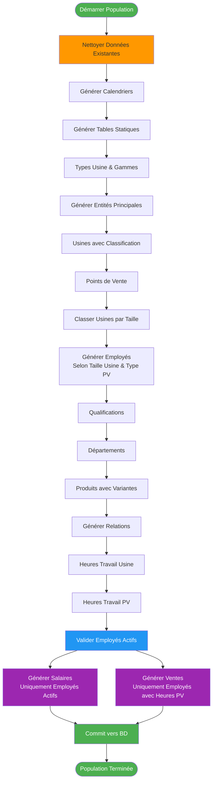
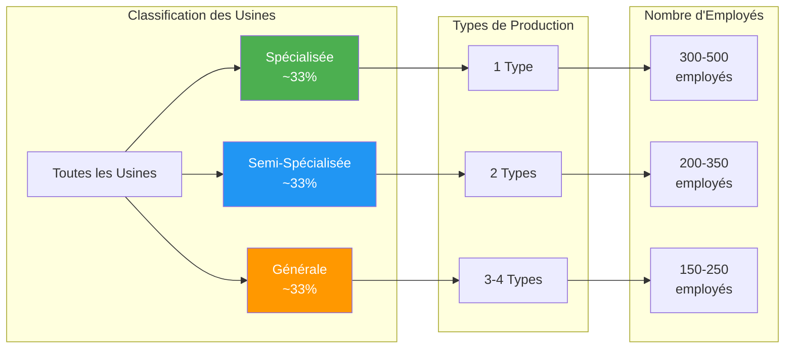
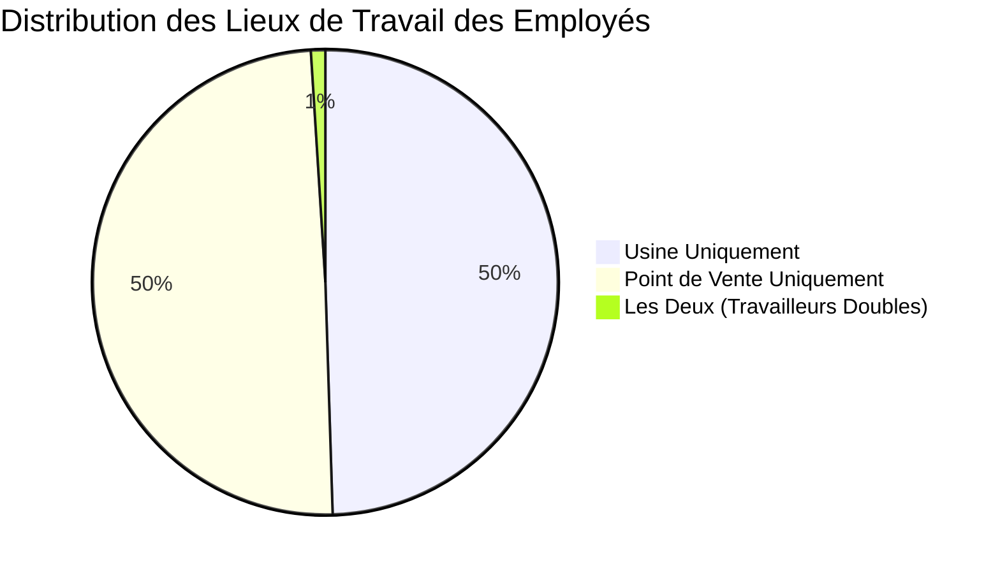
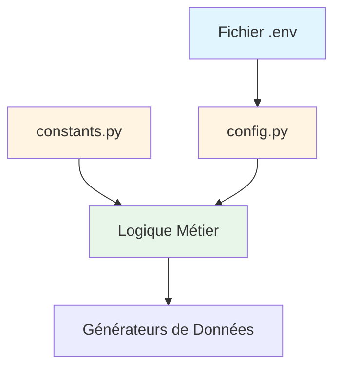
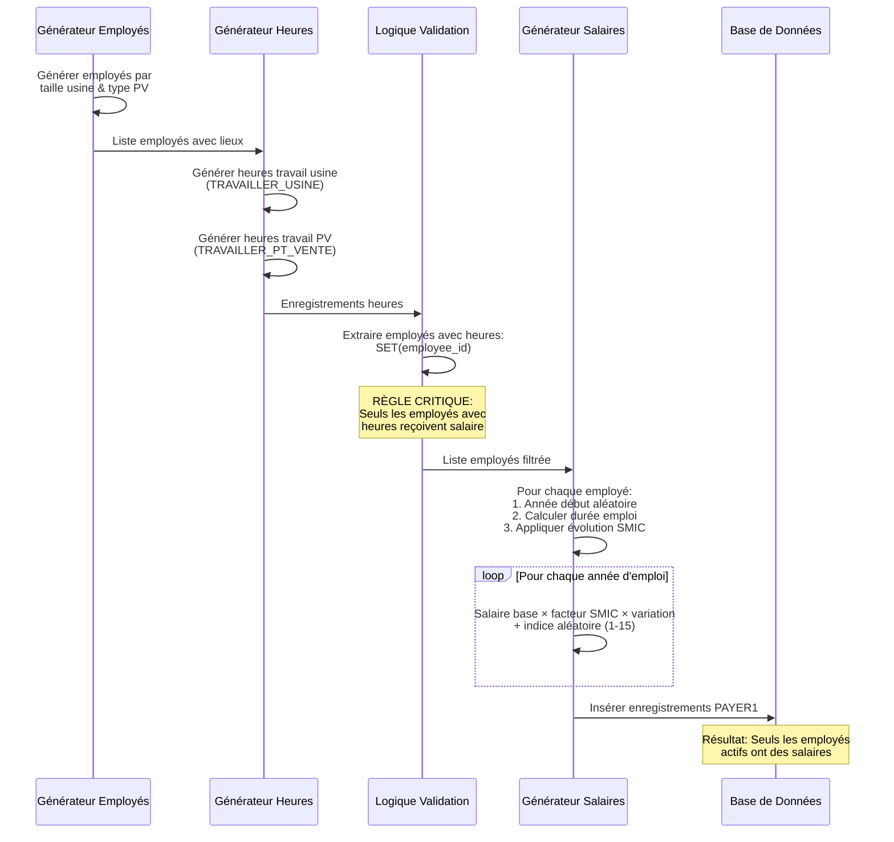
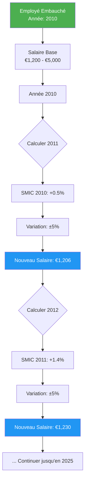
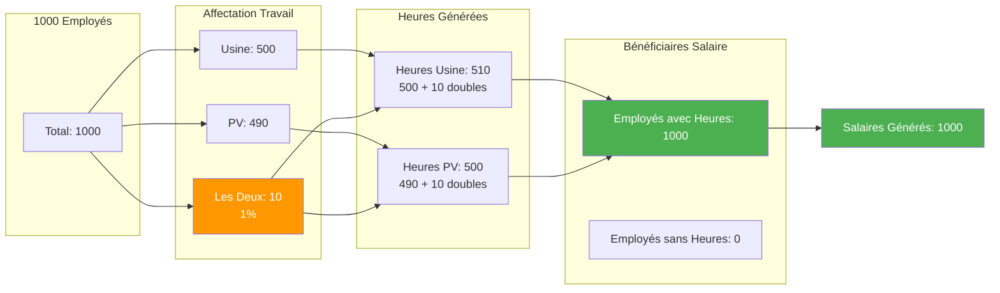
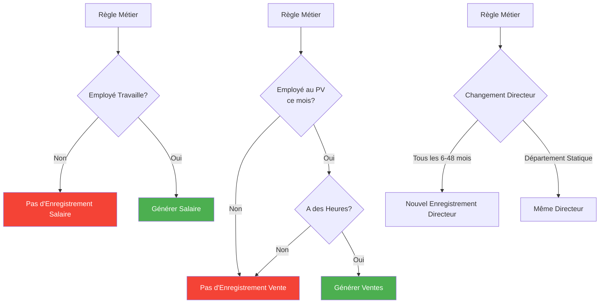
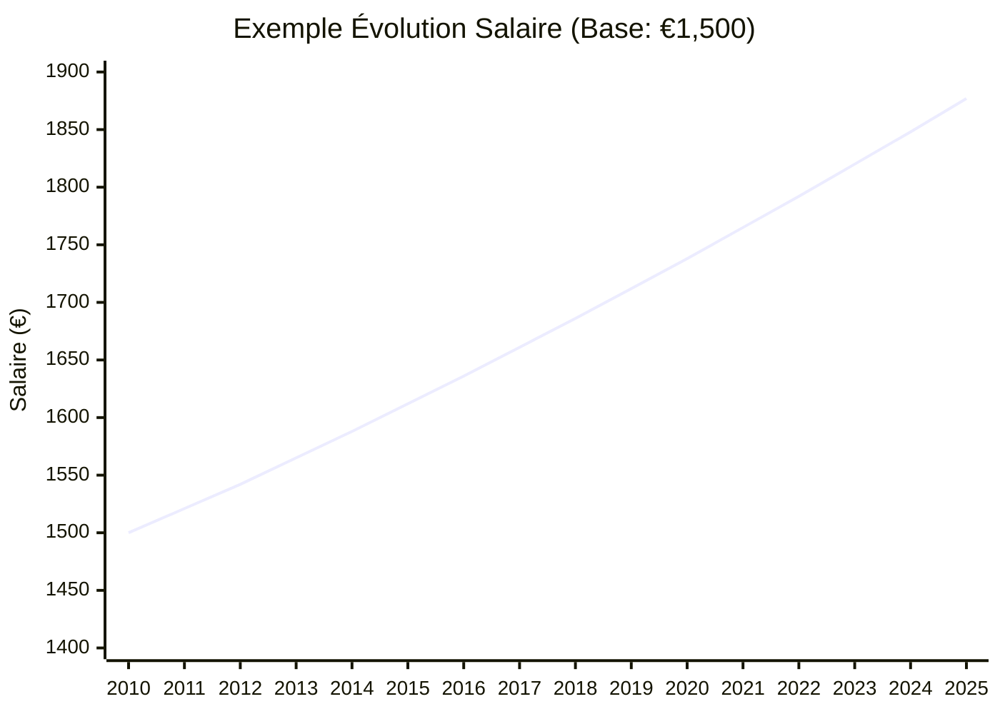

# Stratégie et Implémentation du Peuplement de la Base de Données

## Table des matières

1. [Vue d'ensemble](#vue-densemble)
2. [Architecture et Principes de Conception](#architecture-et-principes-de-conception)
3. [Framework de Génération de Données](#framework-de-génération-de-données)
4. [Génération de Données Réalistes](#génération-de-données-réalistes)
5. [Système de Configuration](#système-de-configuration)
6. [Exemple Complexe : Heures de Travail et Salaires des Employés](#exemple-complexe--heures-de-travail-et-salaires-des-employés)
7. [Intégrité des Données et Contraintes](#intégrité-des-données-et-contraintes)
8. [Optimisation des Performances](#optimisation-des-performances)

---

## Vue d'ensemble

Le système de peuplement de la base de données Brico Plus est un framework Python sophistiqué conçu pour générer des données réalistes, cohérentes et statistiquement valides pour un système complexe de gestion d'entreprise. L'implémentation va au-delà de la simple génération aléatoire de données en intégrant des règles métier réelles, des distributions statistiques et une cohérence temporelle.

### Caractéristiques Clés

-   **Données Réalistes** : Toutes les données générées suivent des modèles et distributions du monde réel
-   **Configurable** : Système de configuration étendu permettant la personnalisation sans modification du code
-   **Scalable** : Capable de générer des milliers d'enregistrements tout en maintenant l'intégrité référentielle
-   **Statistiquement Valide** : Utilise des distributions normales, des calculs de salaires basés sur le SMIC et une évolution temporelle
-   **Conforme aux Règles Métier** : Applique la logique métier telle que "pas de travail = pas de salaire"

---

## Architecture et Principes de Conception

Le système suit une architecture modulaire avec une séparation claire des responsabilités :



### Principes de Conception

1. **Modularité** : Chaque composant a une responsabilité unique et bien définie
2. **Configurabilité** : Les règles métier et paramètres sont externalisés dans des fichiers de configuration
3. **Réalisme des Données** : Adresses françaises réelles, patronymes, évolution du SMIC et distributions d'entreprise
4. **Intégrité Référentielle** : Toutes les relations de clés étrangères sont maintenues grâce à un ordre de génération soigné
5. **Cohérence Temporelle** : Les données temporelles respectent l'ordre chronologique et les cycles métier

---

## Cadre de Génération de Données

### Flux de Génération

La population de données suit une séquence soigneusement orchestrée pour maintenir l'intégrité référentielle :



### Composants Clés

#### 1. Module Générateurs (`generators.py`)

Responsable de la génération des entités de base :

-   **Usines** avec adresses réalistes
-   **Points de Vente** (Brico-Express vs GSB)
-   **Employés** avec adresses professionnelles proches de leur lieu de travail
-   **Produits** avec plusieurs variantes de marque
-   **Qualifications** selon le système français de diplômes

#### 2. Module Générateurs de Relations (`relations_generators.py`)

Gère les relations complexes et données temporelles :

-   **Heures de travail** avec cohérence temporelle
-   **Salaires** avec évolution basée sur le SMIC
-   **Ventes** liées aux heures de travail
-   **Affectations de département** avec changements de directeurs
-   **Enregistrements de fabrication** basés sur la spécialisation des usines

#### 3. Module Base de Données (`database.py`)

Gère les opérations de base de données :

-   **Gestion des connexions** avec Oracle DB
-   **Gestion des contraintes** (désactivation pendant la suppression, réactivation après)
-   **Contrôle des transactions** avec commit/rollback

---

## Génération de Données Réalistes

### 1. Génération d'Adresses

Des adresses françaises réelles sont utilisées à partir de jeux de données officiels :

```python
# Adresses réelles issues de fichiers CSV officiels data.gouv.fr
# Chargées depuis data/adresses/adresses-france-extract.csv
```

**Proximité d'Adresse Professionnelle** : Les adresses professionnelles des employés sont générées près de leur lieu de travail en utilisant le même code postal ou la même ville.

### 2. Système de Classification des Usines

Les usines sont classées en trois catégories selon leur spécialisation, ce qui impacte directement le nombre d'employés :



**Configuration** :

```env
FACTORY_SPECIALIZED_MIN=300
FACTORY_SPECIALIZED_MAX=500
FACTORY_SEMI_SPECIALIZED_MIN=200
FACTORY_SEMI_SPECIALIZED_MAX=350
FACTORY_GENERAL_MIN=150
FACTORY_GENERAL_MAX=250
```

### 3. Types de Points de Vente

Deux types distincts avec différentes caractéristiques :

| Type                     | Probabilité | Employés | Gamme Produits  | Volume de Ventes     |
| ------------------------ | ----------- | -------- | --------------- | -------------------- |
| **Brico-Express**        | 30%         | 8-15     | 20-50 produits  | Faible (1-25 unités) |
| **GSB** (Grande Surface) | 70%         | 75-150   | 80-200 produits | Élevé (5-100 unités) |

### 4. Génération de Variantes de Produits

Chaque type de produit génère plusieurs variantes de marque :

```python
# Exemple : "Perceuse Électrique" génère 2-4 variantes
# - Perceuse Électrique (Bosch)
# - Perceuse Électrique (DeWalt)
# - Perceuse Électrique (Makita)
```

**Configuration** : `PRODUITS_VARIANTS_MIN=2`, `PRODUITS_VARIANTS_MAX=4`

### 5. Fonctionnalité de Double Lieu de Travail

Un pourcentage configurable d'employés travaille à la fois en usine ET en point de vente :



**Règles Métier pour les Travailleurs Doubles** :

-   Travaillent 60-80 heures/mois à chaque emplacement (au lieu de 120-160 temps plein)
-   Doivent avoir des heures de travail aux deux emplacements
-   Reçoivent un salaire basé sur le total des heures
-   Ne peuvent vendre que dans leur point de vente assigné

**Configuration** : `DUAL_WORKPLACE_PERCENTAGE=0.01` (1%)

---

## Système de Configuration

Tous les paramètres critiques sont externalisés pour permettre une personnalisation facile sans modification du code :

### Hiérarchie de Configuration



### Catégories de Configuration Clés

#### 1. Connexion à la Base de Données

```env
ORACLE_HOST=your.server.com
ORACLE_PORT=1521
ORACLE_SERVICE=service_name
ORACLE_USER=username
ORACLE_PASS=password
```

#### 2. Nombres de Génération

```env
NOMBRE_USINES=15              # Nombre d'usines
NOMBRE_POINTS_VENTE=50        # Nombre de points de vente
```

#### 3. Distribution des Employés

```env
# Employés d'usine (par spécialisation)
FACTORY_SPECIALIZED_MIN=300
FACTORY_SPECIALIZED_MAX=500
# ... (semi-spécialisée, générale)

# Employés de point de vente (par type)
PV_EXPRESS_MIN=8
PV_EXPRESS_MAX=15
PV_GSB_MIN=75
PV_GSB_MAX=150
```

#### 4. Configuration des Produits

```env
PRODUITS_VARIANTS_MIN=2       # Variantes de marque min par produit
PRODUITS_VARIANTS_MAX=4       # Variantes de marque max par produit
```

#### 5. Paramètres du Calendrier

```env
CALENDRIER_DATE_DEBUT=2000-01-01
CALENDRIER_DATE_FIN=2025-10-31
```

#### 6. Fonctionnalités Spéciales

```env
DUAL_WORKPLACE_PERCENTAGE=0.01    # 1% travaillent aux deux emplacements
```

---

## Exemple Complexe : Heures de Travail et Salaires des Employés

Cet exemple démontre la logique sophistiquée derrière la génération des salaires des employés, incorporant l'évolution temporelle, les calculs basés sur le SMIC et l'application des règles métier.

### Règles Métier

1. **Pas de travail = Pas de salaire** : Les employés doivent avoir des heures de travail pour recevoir un salaire
2. **Cohérence temporelle** : Les enregistrements de salaire s'alignent avec les périodes d'emploi
3. **Conformité SMIC** : Les salaires suivent l'évolution du salaire minimum français
4. **Emploi continu** : 95% travaillent jusqu'à aujourd'hui, 5% partent plus tôt

### Flux de Données



### Algorithme de Génération des Heures de Travail

```python
def gen_travailler_usine_with_ids(employes_ids, departements_ids,
                                   employee_workplace, cal3):
    """
    Générer heures de travail en usine avec motifs réalistes
    """
    # Pour chaque employé d'usine
    for emp_id, factory_id in factory_employees:
        # Début emploi aléatoire (entre 0 et longueur_calendrier - 12 mois)
        start_idx = random.randint(0, max(0, len(calendar) - 12))

        # 95% travaillent jusqu'à aujourd'hui, 5% partent plus tôt
        if random.random() < 0.05:
            duration = random.randint(6, 24)  # 6-24 mois
            end_idx = start_idx + duration
        else:
            end_idx = len(calendar)  # Jusqu'à aujourd'hui

        # Générer heures de travail continues
        for month_idx in range(start_idx, end_idx):
            month, year = calendar[month_idx]

            # Déterminer heures selon type de travailleur
            if is_dual_worker:
                hours = random.uniform(60, 80)  # Temps partiel (lieu partagé)
            elif random.random() < 0.8:
                hours = random.uniform(120, 160)  # Temps plein
            else:
                hours = random.uniform(35, 119)  # Temps partiel
```

### Calcul des Salaires avec Évolution du SMIC

Le système de salaires utilise les données réelles d'évolution du SMIC (salaire minimum) français :



**Implémentation** :

```python
def gen_payer1_with_ids(employes_ids, cal_yyyy):
    """
    Générer évolution des salaires basée sur tendances SMIC
    """
    SMIC_DATA = [
        {"date": "2010-01-01", "percentage": 0.005},  # +0.5%
        {"date": "2011-01-01", "percentage": 0.014},  # +1.4%
        # ... données historiques SMIC
    ]

    for employee_id in employes_ids:
        start_year = random.choice(available_years)
        base_salary = random.uniform(1200, 5000)

        for year in range(start_year, current_year + 1):
            # Obtenir augmentation SMIC pour cette année
            smic_increase = get_smic_for_year(year)

            # Appliquer variation (±5%)
            variation = random.uniform(-0.05, 0.05)
            yearly_increase = smic_increase * (1 + variation)

            # Calculer facteur cumulatif
            increase_factor *= (1 + yearly_increase)

            # Salaire final pour cette année
            salary = base_salary * increase_factor
            index = random.randint(1, 15)  # Indice salarial

            # Insérer enregistrement
            records.append((employee_id, year, salary, index))
```

### Validation et Application des Règles Métier

```python
# Étape 1: Générer heures de travail
factory_hours = gen_travailler_usine_with_ids(...)
pv_hours = gen_travailler_pv_with_ids(...)

# Étape 2: Extraire employés ayant effectivement travaillé
employees_with_hours = set()
for record in factory_hours:
    employees_with_hours.add(record[0])  # CODEE
for record in pv_hours:
    employees_with_hours.add(record[0])  # CODEE

# Étape 3: Générer salaires UNIQUEMENT pour employés actifs
working_employees = list(employees_with_hours)
salaries = gen_payer1_with_ids(working_employees, calendar)

# Résultat: 100% des employés salariés ont des heures de travail
```

### Exemple de Distribution Statistique



---

## Intégrité des Données et Contraintes

### Stratégie d'Intégrité Référentielle

Le système assure que toutes les relations de clés étrangères sont valides grâce à :

1. **Génération Ordonnée** : Entités parentes avant les enfants
2. **Mapping d'ID** : Les IDs générés par la base sont capturés et utilisés pour les relations
3. **Validation** : Les règles métier empêchent les relations invalides

### Règles Métier Critiques



### Implémentation de "Pas de Travail = Pas de Salaire"

```python
# Collecter employés avec heures de travail
employees_with_hours = set()
for work_record in factory_hours + pv_hours:
    employees_with_hours.add(work_record[0])

# Générer salaires UNIQUEMENT pour employés actifs
salary_records = gen_payer1_with_ids(
    list(employees_with_hours),  # Liste filtrée
    calendar_years
)

# Statistiques
print(f"Total employés: {len(all_employees)}")
print(f"Employés avec heures: {len(employees_with_hours)}")
print(f"Employés sans heures: {len(all_employees) - len(employees_with_hours)}")
print(f"Enregistrements salaire: {len(salary_records)}")
# Sortie: Enregistrements salaire == Employés avec heures
```

### Ventes Liées aux Heures de Travail

```python
def gen_vendre_with_ids(..., trav_pv):
    # Construire index de (employé, pv, mois, année) avec heures
    employee_pv_month_hours = set()
    for codee, codepv, mois, annee, heures in trav_pv:
        employee_pv_month_hours.add((codee, codepv, mois, annee))

    # Pour chaque vente potentielle
    for month, year in sales_dates:
        # Filtrer employés ayant travaillé CE MOIS dans CE PV
        eligible_employees = [
            emp for emp in pv_employees
            if (emp, pv_id, month, year) in employee_pv_month_hours
        ]

        # Seuls les employés éligibles peuvent générer des ventes
        for employee in eligible_employees:
            generate_sale(employee, pv_id, month, year)
```

---

## Optimisation des Performances

### Gestion des Contraintes

Pour éviter les problèmes de verrous et améliorer les performances lors de la suppression de données :

```python
def clear_all_data(cursor):
    # 1. Désactiver toutes les contraintes de clé étrangère
    constraints = get_all_foreign_keys()
    for constraint in constraints:
        cursor.execute(f"ALTER TABLE {table} DISABLE CONSTRAINT {constraint}")

    # 2. Supprimer toutes les données (pas de vérif. FK = plus rapide)
    for table in all_tables:
        cursor.execute(f"DELETE FROM {table}")

    # 3. Réactiver les contraintes
    for constraint in constraints:
        cursor.execute(f"ALTER TABLE {table} ENABLE CONSTRAINT {constraint}")
```

### Insertion par Lots

```python
# Utiliser executemany pour insertions massives (bien plus rapide que insertions individuelles)
cursor.executemany(
    "INSERT INTO EMPLOYES(...) VALUES (:1,:2,:3,...)",
    employee_records  # Liste de tuples
)
```

### Rapport de Progression

```python
for i, record in enumerate(large_dataset):
    process_record(record)
    if i % 1000 == 0:
        print(f"Progression: {i}/{len(large_dataset)} enregistrements")
```

---

## Validation Statistique

### Utilisation de Distribution Normale

Plusieurs aspects utilisent des distributions normales pour le réalisme :

1. **Nombre d'Employés par Usine** :

    - Spécialisée: μ=400, σ=50 (plage 300-500)
    - Semi-spécialisée: μ=275, σ=37.5 (plage 200-350)
    - Générale: μ=200, σ=25 (plage 150-250)

2. **Heures de Travail** :

    - Temps plein: μ=140, σ=10 (plage 120-160)
    - Temps partiel: μ=77, σ=21 (plage 35-119)

3. **Variantes de Produits** :
    - μ=3, σ=0.5 (plage 2-4)

### Motifs Temporels



**Formule** :
$$Salary_{year} = Salary_{base} \times \prod_{y=start}^{current} (1 + SMIC_y \times (1 + Variation_y))$$

Où :

-   $SMIC_y$ = Augmentation officielle SMIC pour l'année $y$
-   $Variation_y$ = Variation aléatoire $\in [-5\%, +5\%]$

---

## Conclusion

Le système de population de données Brico Plus représente une approche complète pour générer des données de test réalistes, cohérentes et statistiquement valides. Réalisations clés :

### Excellence Technique

-   **Architecture modulaire** avec séparation claire des responsabilités
-   **Paramètres configurables** permettant l'adaptation sans changements de code
-   **Optimisation des performances** via opérations par lots et gestion des contraintes

### Qualité des Données

-   **Données réalistes** utilisant adresses françaises réelles, évolution SMIC et motifs métier
-   **Validité statistique** via distributions normales et cohérence temporelle
-   **Intégrité référentielle** maintenue via ordre de génération soigné

### Conformité Logique Métier

-   **Règles métier strictes** : Pas de travail = Pas de salaire, Ventes nécessitent heures de travail
-   **Cohérence temporelle** : Périodes d'emploi, évolution salariale, heures de travail continues
-   **Support double lieu** : Pourcentage configurable avec distribution appropriée des heures

### Scalabilité

-   Capable de générer **des milliers d'employés** (300-500 par usine spécialisée)
-   **Centaines de milliers** d'enregistrements d'heures de travail
-   **Relations complexes** maintenues à travers toutes les entités

Ce système fournit une base solide pour les tests, le développement et la démonstration du système de gestion d'entreprise Brico Plus.

---

## Annexe : Métriques Clés

| Métrique                    | Valeurs Typiques   |
| --------------------------- | ------------------ |
| **Usines**                  | 15                 |
| **Points de Vente**         | 50                 |
| **Employés**                | 3,000-7,000        |
| **Produits**                | 500-1,000          |
| **Enregistrements Heures**  | 100,000+           |
| **Enregistrements Salaire** | 50,000-150,000     |
| **Enregistrements Ventes**  | 10,000-50,000      |
| **Plage Calendrier**        | 2000-2025 (26 ans) |
| **Temps de Génération**     | 30-60 secondes     |

### Vérification de l'Intégrité des Données

```sql
-- Vérifier qu'aucun employé n'a de salaire sans heures de travail
SELECT COUNT(*) FROM PAYER1 p
WHERE NOT EXISTS (
    SELECT 1 FROM TRAVAILLER_USINE tu WHERE tu.CODEE = p.CODEE
    UNION
    SELECT 1 FROM TRAVAILLER_PT_VENTE tpv WHERE tpv.CODEE = p.CODEE
);
-- Attendu: 0

-- Vérifier que les ventes ne se produisent que quand l'employé a travaillé ce mois
SELECT COUNT(*) FROM VENDRE v
WHERE NOT EXISTS (
    SELECT 1 FROM TRAVAILLER_PT_VENTE tpv
    WHERE tpv.CODEE = v.CODEE
    AND tpv.CODEPV = v.CODEPV
    AND tpv.MOIS = v.MOIS
    AND tpv.ANNEE = v.ANNEE
);
-- Attendu: 0
```

---

_Ce document a été généré dans le cadre du projet de base de données Brico Plus Phase 2._
